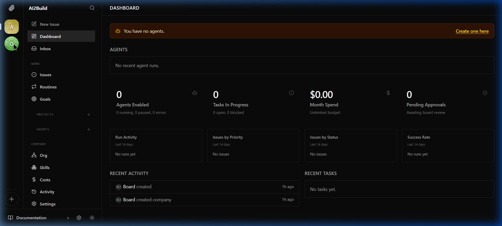
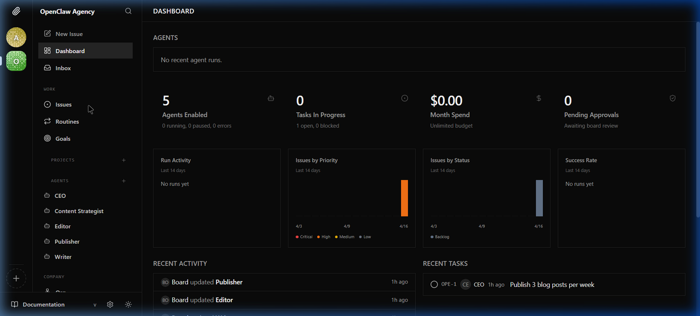
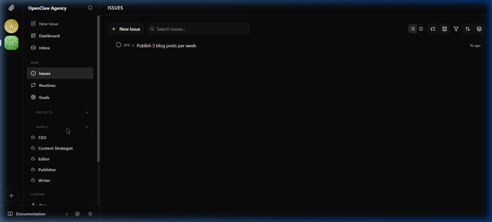
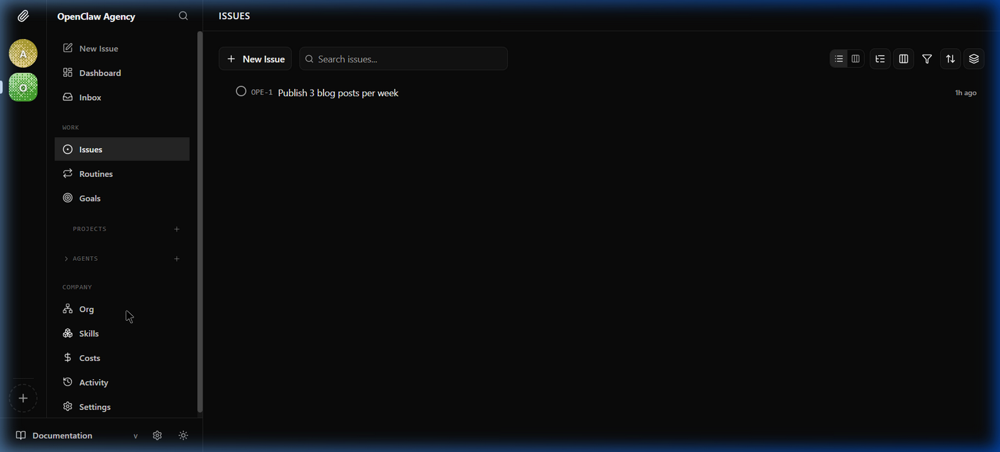

# 📎 Paperclip AI — Tutorial de Instalação e Configuração (Windows 11)

> **Versão testada:** Paperclip `2026.416.0`  
> **Sistema:** Windows 11  
> **Data:** 16/04/2026  
> **Autor:** Taís (OpenClaw Agency)

---

## O que é o Paperclip?

O Paperclip é um servidor Node.js + UI React que **orquestra times de agentes de IA** para rodar um negócio autônomo. Se o OpenClaw é uma funcionária individual, o Paperclip é a empresa inteira — com organograma, issues, rotinas, aprovações e custos.

**Principais recursos:**
- 🏢 **Companies** — crie empresas virtuais com times de agentes
- 🤖 **Agents** — cada agente tem um papel, hierarquia e budget
- 📋 **Issues** — backlog de tarefas como um Kanban/JIRA para agentes
- 🔄 **Routines** — heartbeats e tarefas recorrentes automatizadas
- 🎯 **Goals** — objetivos estratégicos para o time
- 💰 **Costs** — controle de gastos por agente/modelo
- 🔌 **Plugins** — extensível via sistema de plugins

---

## Pré-requisitos

| Ferramenta | Versão Mínima | Como verificar |
|-----------|--------------|----------------|
| Node.js | 20+ | `node --version` |
| pnpm | 9+ | `pnpm --version` |
| git | 2.x | `git --version` |

### Instalando o pnpm (se não tiver)

```powershell
npm install -g pnpm@latest
```

Verifique:
```powershell
pnpm --version
# Esperado: 10.33.0 ou superior
```

---

## Fase 1 — Instalação

### Método Rápido: `npx onboard`

O jeito mais simples — instala, configura e inicializa tudo automaticamente:

```powershell
npx paperclipai onboard --yes
```

> **O que acontece por baixo:**
> 1. Cria a pasta `~/.paperclip/instances/default/`
> 2. Gera um banco PostgreSQL **embedded** (não precisa instalar Postgres!)
> 3. Configura segredos criptografados locais
> 4. Configura o servidor na porta **3100** (loopback only)

### Estrutura criada

```
C:\Users\<user>\.paperclip\
└── instances\
    └── default\
        ├── config.json        ← configuração principal
        ├── .env               ← variáveis de ambiente
        ├── companies\         ← dados das companies
        ├── data\
        │   ├── storage\       ← armazenamento local
        │   └── backups\       ← backups automáticos do DB
        ├── db\                ← PostgreSQL embedded
        ├── logs\              ← logs do servidor
        └── secrets\
            └── master.key     ← chave de criptografia
```

---

## Fase 2 — Verificação (Doctor)

Antes de iniciar, rode o diagnóstico:

```powershell
npx paperclipai doctor
```

**Saída esperada (todos devem ser ✓):**
```
✓ Config file
✓ Deployment/auth mode
✓ Agent JWT secret
✓ Secrets adapter
✓ Storage
✓ Database
✓ LLM provider (optional)
✓ Log directory
✓ Server port

Summary: 9 passed — All checks passed!
```

---

## Fase 3 — Iniciar o Servidor

```powershell
npx paperclipai run
```

O servidor roda o doctor automaticamente e depois inicia:

```
Server listening on 127.0.0.1:3100
```

**URLs importantes:**
| Recurso | URL |
|---------|-----|
| UI (Dashboard) | http://127.0.0.1:3100 |
| API | http://127.0.0.1:3100/api |
| Health Check | http://127.0.0.1:3100/api/health |

### Verificação rápida via CLI:

```powershell
# Health check
curl http://127.0.0.1:3100/api/health
# Esperado: {"status":"ok"}

# Ou via PowerShell
Invoke-RestMethod -Uri "http://127.0.0.1:3100/api/health"
```

---

## Fase 4 — Configuração na UI

### 4.1. Acessar o Dashboard

Abra http://127.0.0.1:3100 no navegador. A primeira tela mostra o Dashboard vazio:



### 4.2. Criar uma Company

1. Clique no botão **"+"** no canto inferior esquerdo
2. Dê um nome para a company (ex: **OpenClaw Agency**)
3. A company aparece no menu lateral esquerdo

### 4.3. Criar Agentes

Na sidebar, em **AGENTS**, clique no **"+"** para criar agentes. Exemplo de time:

| Agente | Função | Reporta a |
|--------|--------|-----------|
| 👔 CEO | Coordenação geral, delegação de tarefas | — |
| 📊 Content Strategist | Planejamento de conteúdo, calendário editorial | CEO |
| ✍️ Writer | Redação de artigos e blog posts | CEO |
| 📝 Editor | Revisão e edição de conteúdo | CEO |
| 🚀 Publisher | Publicação e distribuição | CEO |

Após criar, o dashboard mostra a hierarquia:



### 4.4. Criar Issues

Vá em **Issues** na sidebar e clique em **"+ New Issue"**:



Cada issue tem:
- **Identifier** automático (ex: `OPE-1`)
- **Title** (ex: "Publish 3 blog posts per week")
- **Priority** (critical, high, medium, low)
- **Status** (backlog, todo, in_progress, done)
- **Assignee** (qual agente é responsável)

### 4.5. Seções do Menu

A sidebar contém todas as funcionalidades organizadas:



| Seção | Descrição |
|-------|-----------|
| **Dashboard** | Visão geral: agentes, tasks, gastos |
| **Inbox** | Notificações e mensagens |
| **Issues** | Backlog de tarefas (Kanban-style) |
| **Routines** | Tarefas recorrentes automatizadas |
| **Goals** | Objetivos estratégicos |
| **Org** | Organograma hierárquico |
| **Skills** | Skills/ferramentas dos agentes |
| **Costs** | Controle de gastos por agente |
| **Activity** | Log de atividades |
| **Settings** | Configurações da company |

---

## Fase 5 — CLI Reference (Operações via Terminal)

O Paperclip tem uma CLI completa para automação:

### Companies

```powershell
# Listar todas as companies
npx paperclipai company list

# Detalhes de uma company
npx paperclipai company get <company-id>

# Exportar company (backup portátil)
npx paperclipai company export <company-id>

# Importar company de arquivo/URL
npx paperclipai company import <path-or-url>

# Deletar company (cuidado!)
npx paperclipai company delete <company-id>
```

### Agents

```powershell
# Listar agentes de uma company
npx paperclipai agent list --company-id <company-id>

# Detalhes de um agente
npx paperclipai agent get <agent-id>

# Configurar agente para uso local (CLI/Codex/Claude)
npx paperclipai agent local-cli <agent-ref>
```

### Issues

```powershell
# Listar issues
npx paperclipai issue list --company-id <company-id>

# Criar issue
npx paperclipai issue create --company-id <id> --title "Tarefa X" --priority high

# Atualizar issue
npx paperclipai issue update <issue-id> --status in_progress

# Adicionar comentário
npx paperclipai issue comment <issue-id> --body "Progresso: 50% concluído"

# Atribuir a um agente (checkout)
npx paperclipai issue checkout <issue-id> --agent-id <agent-id>

# Devolver issue ao backlog
npx paperclipai issue release <issue-id>
```

### Configuração

```powershell
# Reconfigurar uma seção (llm, database, logging, server, storage, secrets)
npx paperclipai configure --section llm

# Ver variáveis de ambiente para deploy
npx paperclipai env

# Backup manual do banco
npx paperclipai db:backup
```

### Diagnóstico

```powershell
# Health check completo
npx paperclipai doctor

# Com reparos automáticos
npx paperclipai doctor --fix
```

---

## Fase 6 — Configuração Avançada

### Config File (`config.json`)

O arquivo principal fica em `~/.paperclip/instances/default/config.json`:

```json
{
  "database": {
    "mode": "embedded-postgres",
    "embeddedPostgresPort": 54329,
    "backup": {
      "enabled": true,
      "intervalMinutes": 60,
      "retentionDays": 30
    }
  },
  "server": {
    "deploymentMode": "local_trusted",
    "bind": "loopback",
    "host": "127.0.0.1",
    "port": 3100,
    "serveUi": true
  },
  "storage": {
    "provider": "local_disk"
  },
  "secrets": {
    "provider": "local_encrypted"
  }
}
```

### Portas utilizadas

| Serviço | Porta | Descrição |
|---------|-------|-----------|
| Paperclip Server | 3100 | UI + API |
| PostgreSQL Embedded | 54329 | Banco de dados |

### Modos de Deploy

| Modo | Acesso | Uso |
|------|--------|-----|
| `local_trusted` | Apenas loopback (127.0.0.1) | Desenvolvimento local |
| `lan` | Rede local | Acesso LAN |
| `tailnet` | Via Tailscale | Acesso remoto seguro |

---

## Troubleshooting

### Erro: "Port 3100 is in use"
```powershell
# Verificar o que está usando a porta
netstat -aon | findstr :3100

# Matar o processo se necessário
Stop-Process -Id <PID> -Force
```

### Erro: "Stale PostgreSQL lock file"
O Paperclip resolve isso automaticamente ao iniciar. Se persistir:
```powershell
# Remover lock file manualmente
Remove-Item "$env:USERPROFILE\.paperclip\instances\default\db\postmaster.pid" -Force
```

### Verificar logs
```powershell
# Logs em tempo real
Get-Content "$env:USERPROFILE\.paperclip\instances\default\logs\paperclip.log" -Tail 50 -Wait
```

---

## Referência Rápida

```powershell
# Iniciar o Paperclip
npx paperclipai run

# Parar (Ctrl+C no terminal)

# Health check
npx paperclipai doctor

# Listar companies
npx paperclipai company list

# Listar agentes
npx paperclipai agent list --company-id <id>

# Listar issues
npx paperclipai issue list --company-id <id>

# Dashboard resumido
npx paperclipai dashboard get --company-id <id>

# Backup do banco
npx paperclipai db:backup
```

---

## IDs da Nossa Instalação

Para referência futura:

| Recurso | ID |
|---------|-----|
| Company: OpenClaw Agency | `cbe84f87-28a9-4170-a612-a9e1201c5c2b` |
| Company: AI2Build | `01ca784d-6ba2-4767-a5f0-c109f3fa6686` |
| Agent: CEO | `e4351261-b695-4575-b427-a199e2853c8d` |
| Agent: Content Strategist | `27c65dea-8fb1-4ac2-8b4e-1954ecee1387` |
| Agent: Writer | `f69d4f43-e941-408a-9cdc-56fe4672848a` |
| Agent: Editor | `cfa06ee3-886e-4083-af97-901e3f24c136` |
| Agent: Publisher | `0d1ef1c6-f373-4432-a153-53010975ef51` |
| Issue: OPE-1 | `013b7900-a4f8-47bf-bd05-0f581d926e07` |

---

*Última atualização: 16/04/2026 19:15*
